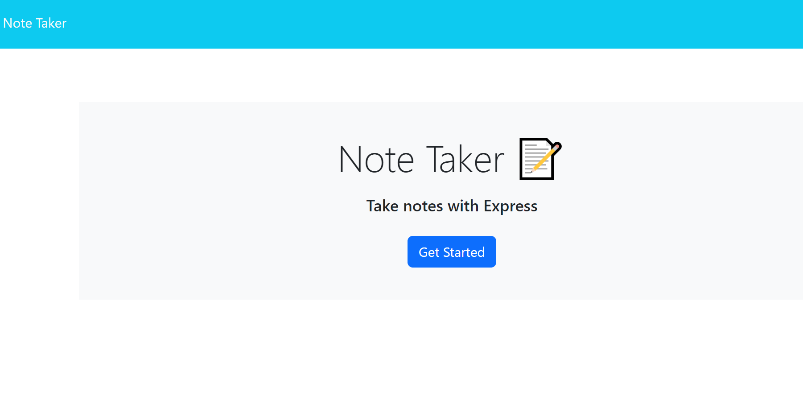
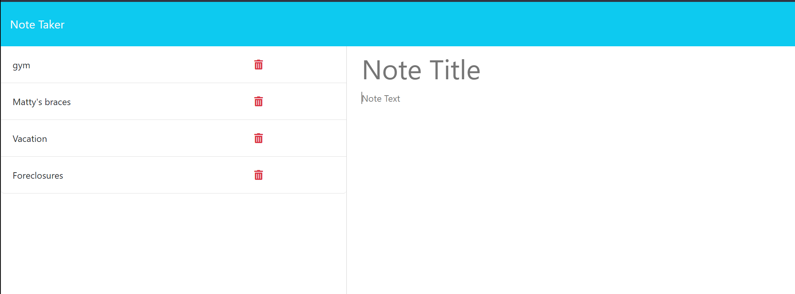
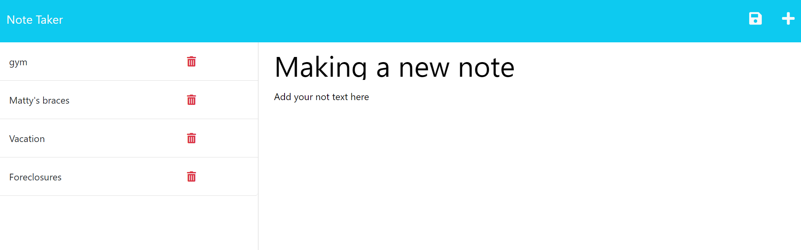

## Eureka Note Taker 

## Description

This is a note taking app created in order to facilitate and ease the burden of remembering life's tasks. We all know how hard it can be to remember everything. Sometimes we need a little software help in making sure we keep up with Uncle Rick's birthday or Janie's piano lessons. This app aided me in cementing what I learned regarding how to build backend product via express and fs utilities.

## Usage

Upon arriving at the site at https://note-taker-1981.herokuapp.com/ click on the 'Get Started' button.
   

This will take you to the Notes page:

From there, type the title of your note in the 'Note Title' field and then hit the save button. If you'd like to then add another note, click on the '+' icon.

   

## Credits

| GitHub Username | Name |
|:---------------: |:----------------:|
|Xandromus | Xander Rapstine |
|nol166 |John McCambridge| 
|Georgeyoo|George|

## License

This project uses an MIT license.

For more on this license see: https://opensource.org/licenses/MIT
